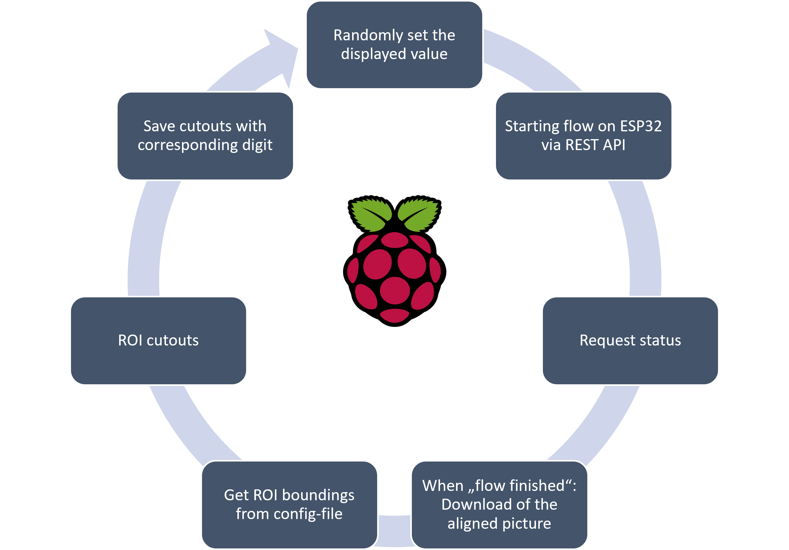
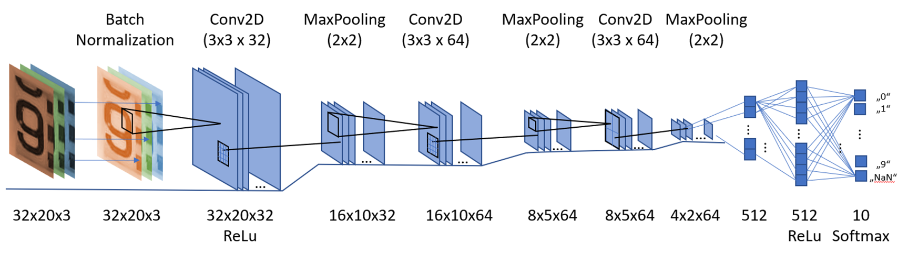
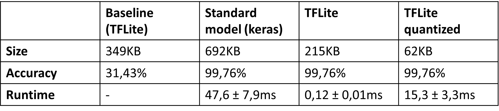
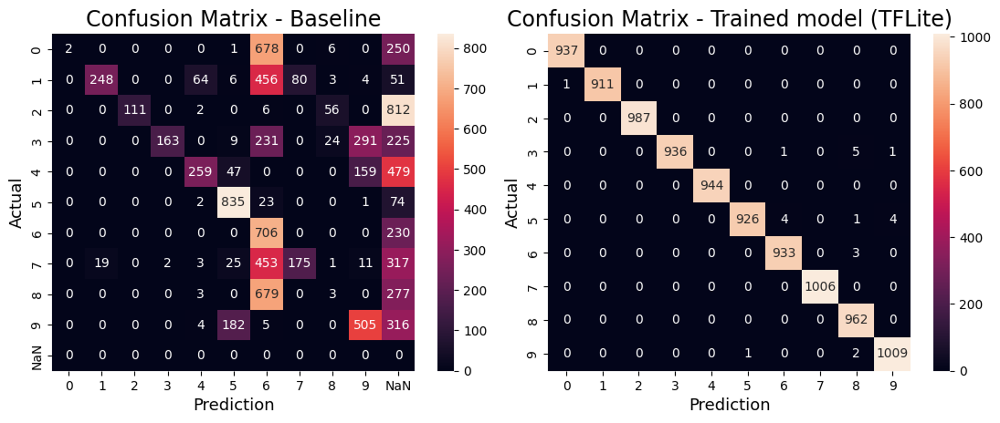
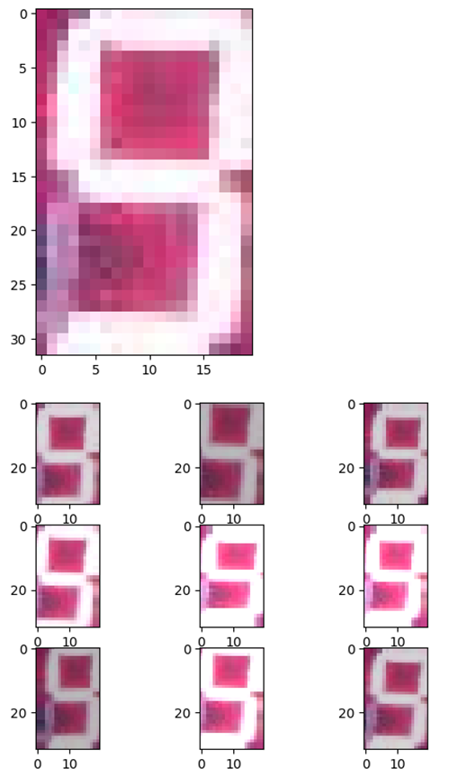
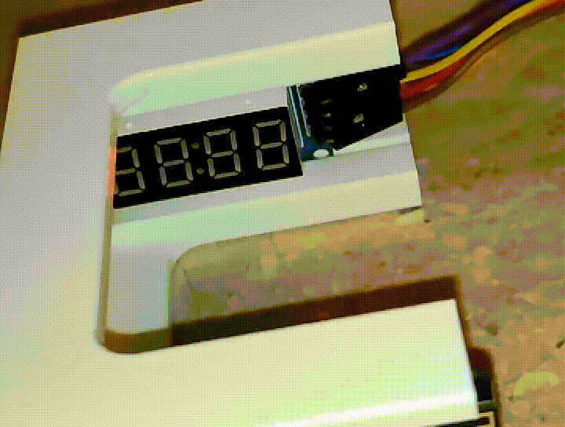
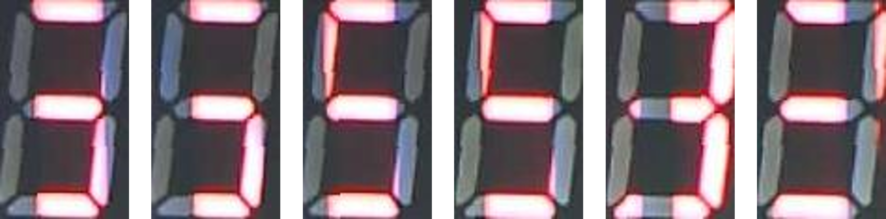

<!--- CPS
Author: <NAME>  Date: <JJJJ MMM DD> 
Changes by:
<NAME> - <JJJJ MMM DD> - <comment> 

--->
**Cyber Physical Systems**     
Fakultät 04 
***

# Modularbeit: AI on the edge
## Autor: Sebastian Veigl

***

## Objectives

- Use an esp32cam as AI on the edge device detecting digits on an 7-segment display
- Utilizing the [AI-on-the-edge-device](https://github.com/jomjol/AI-on-the-edge-device) github-repository by [jomjol](https://github.com/jomjol)
- Training the used neural net for the special use case of the 7-segment display

## Prerequisites and required equipment

### For AI on the edge device using the 7-segment display:
  

- esp32cam
  - min. 4 MB of PSRAM (see [Hardware Compatibility](https://jomjol.github.io/AI-on-the-edge-device-docs/Hardware-Compatibility/) for known-working models)
  - OV2640 camera module
- micro SD-Card (preferable max. 16-32 GB)
- 5V voltage supply ([USB-breakout board](https://www.reichelt.de/entwicklerboards-breakout-board-mit-microusb-debo-microusb-p235502.html?PROVID=2788&gclid=CjwKCAiAp5qsBhAPEiwAP0qeJlUKYR2Ky4i1cNpVwsTMjPRNG9YKlgDQA9UiotmsCMJM1c-haZ3J7hoC8_EQAvD_BwE))
- 3.3V USB-TTL connector (e.g. https://www.amazon.de/DSD-TECH-Seriell-Adapter-Kompatibel/dp/B07BBPX8B8)
- TM1637 7-segment display
- (3D-printed) Holder for keeping the esp32cam in place in front of the display

### For training:
- Raspberry Pi 
  - Python 3.9.2 interpreter + ability to run jupyter notebooks
- "Powerful" machine for training of the neural network

## Solutions Steps

### Installation and setup of AI-on-the-edge-device on the esp32cam

1. **Flashing the firmware**  
Connect the esp32cam-board with the USB-TTL connector as shown in the wiring diagram.  
  
Before flashing the firmware to the esp32cam, we have to bring the module into flash mode. Therefore, pin *IO0* has to be pulled low by connecting the pin with *GND*.
Then the *RST* button has to be pressed.  
There are multiple ways of flashing the firmware described in the [installation documentation](https://jomjol.github.io/AI-on-the-edge-device-docs/Installation/), we will be using the provided [Web Installer](https://jomjol.github.io/AI-on-the-edge-device/).
Enter the installer with your esp32cam connected to the computer using the USB-TTL connector **(make sure to use a 3.3V connector for the ESP32!)**. Select the corresponding COM-Port and start the installation of the current firmware version *v15.3.0* (this could take a few minutes).  
After getting the message of successful installation, you have to disconnect the bridge from *IO0* to *GND*.

2. **Setting up the SD-card**  
Before booting the esp32cam for the first time, we have to set up the SD-card expected by the firmware. First, format the SD-card in FAT32 format (see [Notes on the SD card](https://jomjol.github.io/AI-on-the-edge-device-docs/Installation/#manual-setup-with-an-sd-card-reader-on-a-pc)).  
Download the current SD-card content form the [release page](https://github.com/jomjol/AI-on-the-edge-device/releases). There you have to download the *AI-on-the-edge-device__manual-setup__vXX.X.X.zip* file and copy the contents of the extracted *sd-card* sub-folder to your microSD-card.
The content should look like this:  
  
With editing the included *wlan.ini* file, we can set up the WI-FI connection. Insert the SSID and password into the file. The hostname and other connection parameters can also be changed inside this file.  
When everything is set up you can insert the SD-card into the esp32cam.

3. **5V voltage supply**  
Connect to a 5V supply while unplugging the voltage supply of the USB-TTL connector as shown in the wiring diagram. The remaining connection to the USB-TTL connector is optional and can be used for debugging via a serial monitor.  


4. **Configuration using the Web-UI**  
Enter the Web-UI using the IP address given to your esp32cam. If everything was successful, you should be welcomed with the configuration page.  
The first step is to take a reference picture. This will be the basis for the coordinate system of the ROIs (Regions of Interest) later on.  
With this being the first time to see a picture taken by the esp32cam, we can **adjust the focus** of the camera module. Therefore, you have to remove the glue used for fixing the focus ring into place and turn the ring with a pair of pliers in order to set the focal length.  
  
With the focus being set, you can proceed with the configuration. After taking the **reference image** and aligning it horizontally, you can define two **alignment references**.
These will be used to check and adjust the alignment. It is recommended to use unique structures with good contrast.  
The most important part during configuration is to set up the ROIs. These will later be used for the digit classification. As we are using a 7-segment display, only digit ROIs have to be set up. I was using the display as temperature display, so only ROIs where set up (up to 4 digits would be possible with this display). Here you can also provide information about the order/multiplier to take into account decimal values.   
  
After everything is set up correctly, you have to reboot the esp32cam.  
For further information on how to configure the AI-on-the-edge-device firmware have a look at the [documentation](https://jomjol.github.io/AI-on-the-edge-device-docs/Reference-Image/).

5. **Selecting the trained neural model**  
After reboot you might be recognizing (assuming the display is already showing something) that the preconfigured neural network used for the classification of the digits is not working properly with the 7-segment display.  
Therefore, we will have to change the model by importing the *7seg2312.tflite* model that was already trained on ~2500 digits (see next chapter for instructions) into the file server running on the esp32cam (*System -> File Server -> Upload*).  
Now it will be an available option under *Settings -> Configuration -> Digit ROI Processing -> Model*. After the next reboot the digits will be recognized correctly.


### Auto-training on the 7-segment display using the Raspberry Pi

1. **Training setup**  
Connect the Raspberry Pi to the TM1637 7-segment display as shown in the following wiring diagram (connect voltage supply and SCL->GPIO5, DIO->GPIO4):  

  
Make sure that the segment display is aligned with the esp32cam, if necessary adjust the ROI positions in the WebUI.

2. **Software setup on the Raspberry Pi**  
Connect to the Raspberry Pi using SSH, clone the repository and install the required python packages (using Python 3.9.2):
```shell
git clone https://github.com/SebastianVeigl/AI_on_the_edge_segment_train
cd AI_on_the_edge_segment_train/
pip3 install -r requirements.txt
```

3. **Run the script for generating training data**  
Run the script using the following command including the IP address of the esp32cam (as *$ESP32_IP_ADDRESS*) (make sure that both devices are in the same network).
```shell
python picture_grabber.py $ESP32_IP_ADDRESS
```
Alternatively you can use:
```shell
nohup python picture_grabber.py $ESP32_IP_ADDRESS
```
  

This will prevent the process from stopping when disconnecting the SSH terminal.  
What the script does is:  
- Display a random temperature on the segment display
- Starting the flow on the esp32cam, meaning: take a picture, align it, extract the ROIs and try to recognize the digits 
- When the flow is finished: get the detected value/download the raw aligned image using the built-in REST API 
- Get the ROI box positions from the *conf.ini* file on the esp32cam file server 
- Cut out the ROIs from the raw aligned image
- Save the cutouts in the corresponding directory under *digits/...*  


4. **Downloading the training data**  
After letting the script run for a few hours, you should have gathered a few hundred pictures. For training the neural net we need a "powerful" computer. 
So we have to download the pictures inside the *digits* directory taken by the script. For this you can either use th *scp*-command on Linux-machines or *WinSCP* on Windows.  

5. **Setting up the training environment**  
For training you need the python (3.10) packages defined in the *training/requirements.txt* file. For installation first clone the repository, then use:  
```shell
git clone https://github.com/SebastianVeigl/AI_on_the_edge_segment_train
cd AI_on_the_edge_segment_train/
pip install -r training/requirements.txt
```
After installing all necessary packages you can run JupyterLab using the following command:
```shell
jupyter-lab training
```

6. **Preparing the data**  
**Note:** The used notebooks were  provided by this [repository](https://github.com/jomjol/neural-network-digital-counter-readout) but slightly improved  
For preparation of the data (i.e. resizing to 32x20 pixels) you have to execute the *training/Image_Preparation.ipynb* notebook. This should fill the directory *digits_resized* with the resized images.

7. **Training the model**

Use the provided *training/Train_CNN_Digital-Readout.ipynb* notebook for training the network. This will take the saved images as training/validation data for the Convolutional Neural Network (CNN). Set the value of *tflite_model_name_version* in order to change the name of the resulting files.   
At the end of the training the best model weights, saved as checkpoint, are loaded and evaluated. Afterward, the model gets saved in the lightweight tflite format. You can even use a further compressed/quantized version of the model (*...q.tflite*).  
After the training is done, the model can be uploaded to the esp32cam and used for the ROI digit recognition.

#### Results
The pictures below show the comparison od size, accuracy and runtime of the model coming with *AI-on-the-edge-device* (baseline), the trained model in keras format, tflite format and a quantized version.

  

Here you can see the confusion matrix of the baseline model (not trained on the 7-segment pictures) and the trained model:



### Inference on other devices (e.g. Raspberry Pi)  
1. **Installing the Required package**  
For using the trained tflite model on a Raspberry Pi, you are required to install the *tflite-runtime* package using:   
```bash
pip3 install tflite-runtime
```  
2. **Running inference**  
The code below can be used to classify a picture of a digit cutout using the before trained tflite model on the Raspberry Pi.  
```python
import tflite_runtime.interpreter as tflite
import numpy as np
from PIL import Image

TFLITE_FILE_PATH = '../models/7seg2912.tflite'

# Load the TFLite model in TFLite Interpreter
interpreter = tflite.Interpreter(TFLITE_FILE_PATH)
interpreter.allocate_tensors()

# Get input and output tensors.
input_details = interpreter.get_input_details()
output_details = interpreter.get_output_details()

# Test the model on random input data.
input_shape = input_details[0]['shape']

image_in = Image.open('../training/digits_resized/8_19_12_2023_18_48_08.jpg')
test_image = np.array(image_in, dtype="float32")
img = np.reshape(test_image, input_shape)

interpreter.set_tensor(input_details[0]['index'], img)

interpreter.invoke()

# The function `get_tensor()` returns a copy of the tensor data.
# Use `tensor()` in order to get a pointer to the tensor.
output_data = interpreter.get_tensor(output_details[0]['index'])
print(output_data)
print(output_data.argmax())
```
This code can be found in the [repository](https://github.com/SebastianVeigl/AI_on_the_edge_segment_train) (*inference/tflite_inference_RPi.py*) where you can also find some example pictures.

## Further Inputs
- The code used for getting the training data and training th neural net can be found under: <https://github.com/SebastianVeigl/AI_on_the_edge_segment_train>
- The SD-card content (incl. settings, etc.) used for my implementation can be found in the repository 

## Hints and pitfalls

### Installation  
- It might be necessary to supply the esp32cam with 5V during flashing the firmware, if you have problems during installation.
- You can check if the flash mode was entered successfully by checking the Logs on the [Web Installer](https://jomjol.github.io/AI-on-the-edge-device/). After pressing the *RST* button on the board, the log should show something like *"waiting for download"*.
- Status indication by blinking:
  - **fast, endless blinking:** Problem with the SD-card
  - **5 x fast blinking (< 1 second):** connection still pending 
  - **3 x slow blinking (1 second on/off):** WLAN connection established

### Set-up
- For setting up the focus of the camera you can use the included livestream function (<http://$CAM-IP$/stream>)
- I have disabled the alignment algorithm by setting the *Alignment Algorithm* option in the Configuration to *Off*. This resulted in faster computation (no alignment step) and was sufficiently accurate.
- For the self-illuminated segment display, the flashlight intensity can be decreased to 10% or lower, this will decrease reflections.

### Training
- During training augmentation (changing rotation, zoom, brightness, ...) of the raw pictures is used to prevent overfitting and improve generalization. An example of resulting pictures can be seen in the picture below: 
  
- I encountered problems classifying pictures taken at bright environments (e.g. direct sun). Then the pictures contain lines due to the short exposure time and refresh of the display. This leads to unambiguous pictures that are hard to classify. 
  
  
This problem could be fixed with a more encapsulated holder.

### Inference  
- For inference on the PC you can also replace the *tflite_runtime* package with the *tensorflow.lite* subpackage.

## Useful Resources for Own Searches

### Links

AI-on-the-edge docs: 
<https://jomjol.github.io/AI-on-the-edge-device-docs/>

neural-network-digital-counter-readout:
<https://github.com/jomjol/neural-network-digital-counter-readout>

Tensorflow Lite guide:
<https://www.tensorflow.org/lite/guide>

WinSCP download:
<https://winscp.net/eng/download.php>

raspberrypi-tm1637:
<https://github.com/depklyon/raspberrypi-tm1637>

Arduino TM1637 library:
<https://github.com/avishorp/TM1637>

